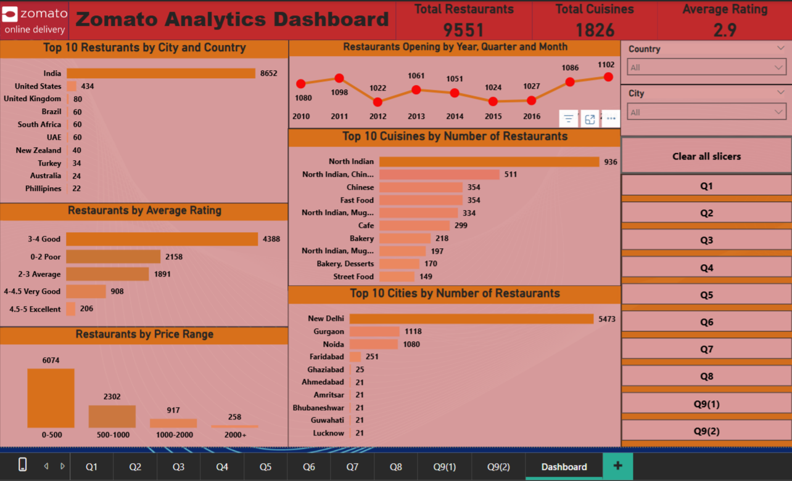
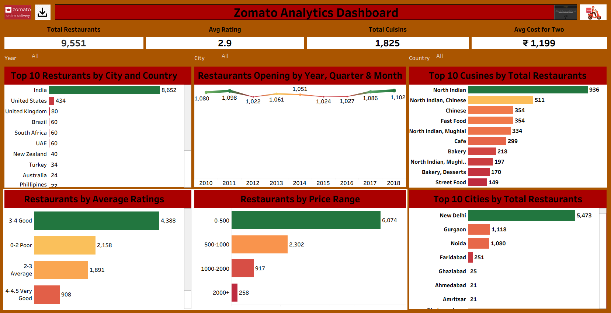
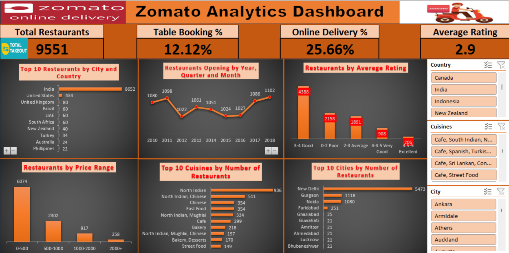

# Zomato Analytics Dashboard

## Project Overview
End-to-end data analytics project using SQL, Excel, Power BI, and Tableau to analyze restaurant data and generate actionable business insights.

## Tools Used
- SQL
- Excel
- Power BI
- Tableau
- Data Visualization
- KPI Analysis

## Key KPIs
- Total Restaurants: 9,551
- Average Rating: 2.9
- Online Delivery Percentage: 25.66%
- Table Booking Percentage: 12.13%
- Total Cuisines: 1,826
- Average Cost for Two: ₹1,199

## Analysis Performed
- Top restaurants by country and city
- Restaurant opening trend by year
- Cuisine popularity analysis
- Price range distribution
- Ratings distribution
- Top cities by restaurant count
- Online delivery and table booking availability

## Dashboard Features
- Interactive slicers (Country, City, Cuisines)
- KPI cards for quick insights
- Trend analysis visualization
- Category-wise comparisons
- Dynamic filtering for business exploration

## SQL Work
- Joins for dataset relationships
- Window functions for ranking analysis
- GROUP BY and HAVING for aggregation
- Subqueries for advanced filtering
- Business KPI calculations
- Complex analytical queries

## Power BI Dashboard

## Tableau Dashboard

## Excel Dashboard

## Key Insights
- India dominates with highest restaurant count
- Majority restaurants fall in ₹0–500 price range
- North Indian cuisine most popular
- Most ratings lie between 3–4 category
- Online delivery adoption is moderate
- Table booking availability is low
- Restaurant growth trend is stable across years

## Author
Navdeep Khandelwal  
SQL | Excel | Power BI | Tableau | Data Visualization | Data Analysis
